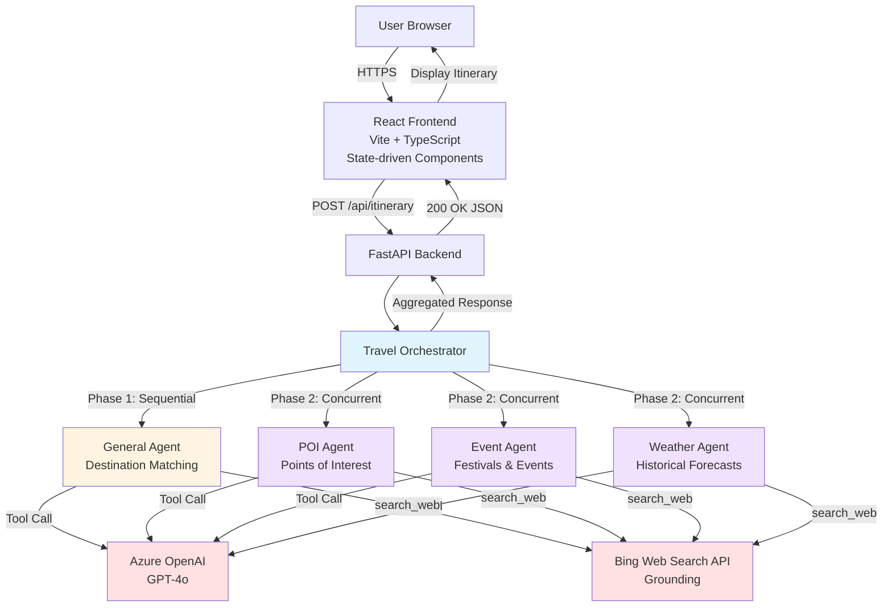
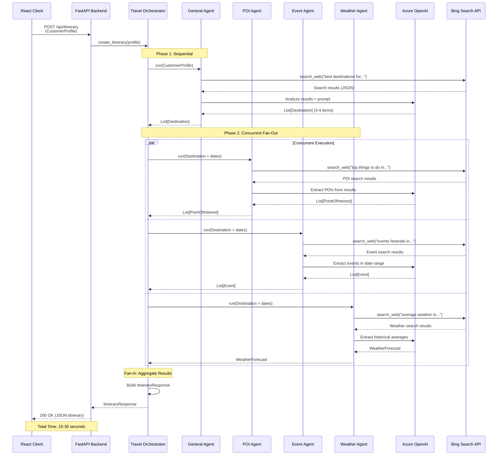
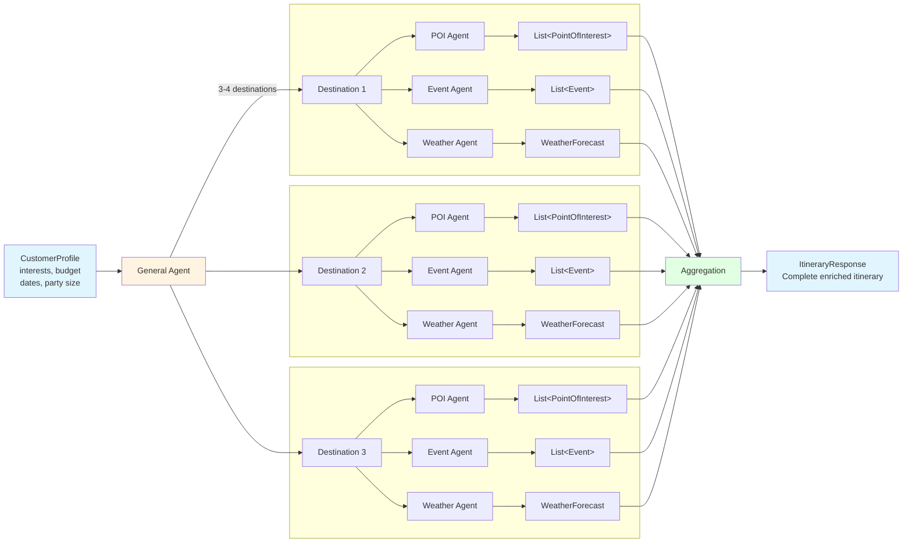
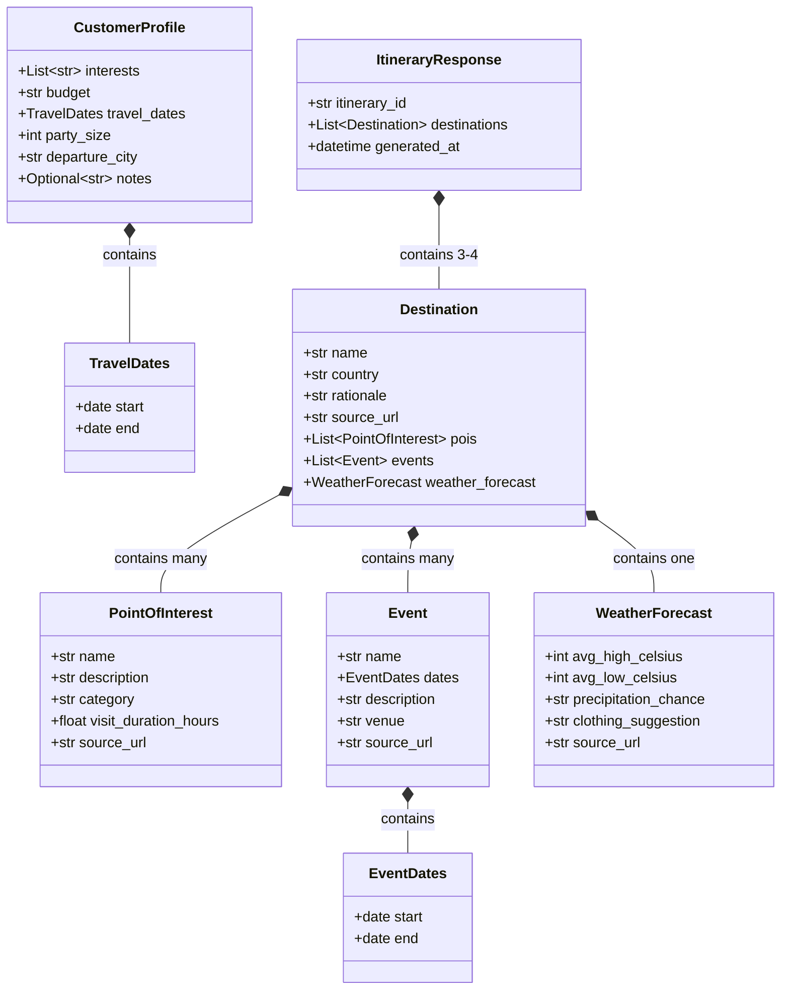
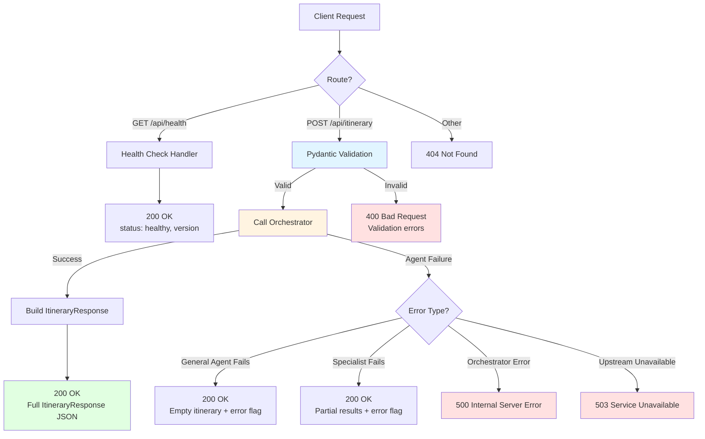
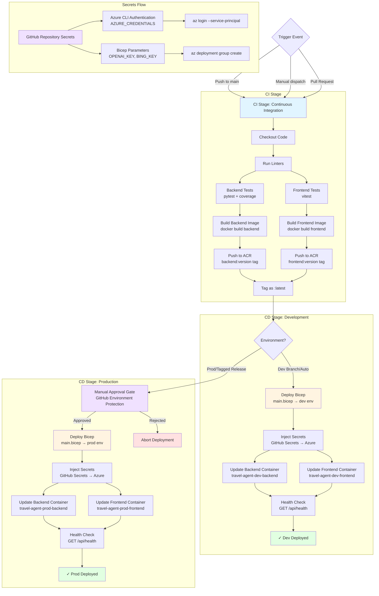
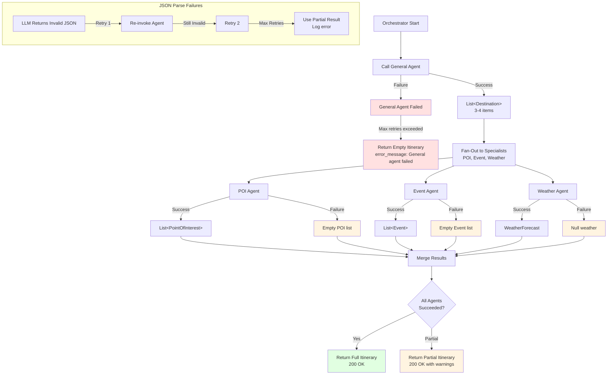

# Travel Agent Application — Architecture Diagrams

> **Source:** Auto-generated from [architecture.md](architecture.md) — update when architecture changes.

This document provides visual representations of the Travel Agent Application architecture using Mermaid diagrams. Each diagram focuses on a specific aspect of the system for clarity and maintainability.

---

## Table of Contents

1. [System Overview](#1-system-overview)
2. [Frontend Component Architecture](#2-frontend-component-architecture)
3. [Agent Orchestration Sequence](#3-agent-orchestration-sequence)
4. [Data Flow Pipeline](#4-data-flow-pipeline)
5. [Pydantic Model Class Diagram](#5-pydantic-model-class-diagram)
6. [API Request/Response Flow](#6-api-requestresponse-flow)
7. [Infrastructure Diagram](#7-infrastructure-diagram)
8. [CI/CD Deployment Pipeline](#8-cicd-deployment-pipeline)
9. [Error Handling Flow](#9-error-handling-flow)

---

## 1. System Overview

High-level architecture showing the complete system from React frontend through to external services.



**Key Points:**
- React frontend with complete component architecture (see Frontend Component Architecture diagram)
- Orchestrator coordinates two-phase agent execution
- All agents grounded in Bing Web Search (mandatory search-first pattern)
- Azure OpenAI (GPT-4o) provides reasoning for all agents

---

## 2. Frontend Component Architecture

Complete Phase 4 frontend component structure showing state management, conditional rendering, and API integration.

```mermaid
graph TD
    App[App.tsx<br/>Root Component] -->|uses| UseItinerary[useItinerary Hook<br/>State Management]
    
    UseItinerary -->|manages states| States{Application State}
    UseItinerary -->|calls| API[itineraryApi.ts<br/>API Client]
    
    States -->|idle| CustomerForm[CustomerForm Component<br/>User Input Form]
    States -->|loading| LoadingState[LoadingState Component<br/>Spinner + Progress Text]
    States -->|success| ItineraryView[ItineraryView Component<br/>Results Display]
    States -->|error| ErrorState[ErrorState Component<br/>Error Message]
    
    CustomerForm -->|onSubmit| UseItinerary
    ErrorState -->|retry| UseItinerary
    
    ItineraryView -->|maps| DestinationCards[DestinationCard Components<br/>One per Destination]
    
    subgraph "DestinationCard Content"
        DestinationCards --> POIs[POI List<br/>Points of Interest]
        DestinationCards --> Events[Event List<br/>Festivals & Activities]
        DestinationCards --> Weather[Weather Widget<br/>Forecast Display]
    end
    
    API -->|fetch POST| APIBoundary[/api/itinerary<br/>REST Endpoint]
    APIBoundary -.->|200 OK JSON| API
    APIBoundary -.->|4xx/5xx Error| API
    
    subgraph "State Transitions"
        Idle[idle: Initial] --> Loading[loading: API Call]
        Loading --> Success[success: Data Received]
        Loading --> Error[error: Request Failed]
        Error --> Idle2[idle: After Retry]
    end
    
    style App fill:#e1f5ff
    style UseItinerary fill:#fff4e1
    style States fill:#f0e1ff
    style ItineraryView fill:#e1ffe1
    style CustomerForm fill:#e1f5ff
    style LoadingState fill:#fff4e1
    style ErrorState fill:#ffe1e1
    style API fill:#f0e1ff
    style APIBoundary fill:#ffe1e1
```

**Component Responsibilities:**

1. **App.tsx**: Root component that renders based on `useItinerary` state
2. **useItinerary Hook**: Manages application state lifecycle (idle → loading → success/error)
3. **CustomerForm**: Collects user preferences (interests, budget, dates, party size)
4. **LoadingState**: Displays loading spinner with status text during API call
5. **ItineraryView**: Renders successful response with destination cards
6. **DestinationCard**: Shows POIs, events, and weather for each destination
7. **ErrorState**: Displays error message with retry button
8. **itineraryApi.ts**: Type-safe API client using fetch (POST to `/api/itinerary`)

**State Machine Flow:**
- **idle**: Initial state; shows CustomerForm
- **loading**: API call in progress; shows LoadingState
- **success**: Data received; shows ItineraryView
- **error**: Request failed; shows ErrorState with retry → back to idle

**API Boundary:**
- Frontend sends `CustomerProfile` JSON
- Backend returns `ItineraryResponse` with destinations array
- Error handling: 4xx/5xx responses trigger error state

---

## 3. Agent Orchestration Sequence

Detailed sequence diagram showing the two-phase orchestration flow with timing.



**Timing:**
- Phase 1 (General Agent): ~5-10 seconds
- Phase 2 (Specialists): ~5-10 seconds (parallel execution)
- Total: 15-30 seconds end-to-end

---

## 4. Data Flow Pipeline

How customer data transforms through the agent pipeline into a complete itinerary.



**Transformations:**
1. **CustomerProfile** → General Agent → **List[Destination]** (3-4 items)
2. Each **Destination** → 3 specialist agents (concurrent)
   - POI Agent → **List[PointOfInterest]**
   - Event Agent → **List[Event]**
   - Weather Agent → **WeatherForecast**
3. All outputs → Deterministic merge → **ItineraryResponse**

---

## 5. Pydantic Model Class Diagram

Data model relationships showing composition and aggregation patterns.



**Model Locations:**
- All models defined in `src/api/models/`
- Shared between API routes and agent orchestrator
- Single source of truth for data contracts

---

## 6. API Request/Response Flow

HTTP layer showing endpoint routing, validation, and error handling.



**Error Handling Strategy:**
- **400**: Invalid input (Pydantic validation failure)
- **500**: Orchestrator or unhandled error
- **503**: Azure OpenAI or Bing Search unavailable
- **Partial Success**: Specialist agent failures return partial itinerary (not 500)

---

## 7. Infrastructure Diagram

Azure deployment architecture showing all managed services and container apps with AI Foundry governance layer.

```mermaid
graph TB
    subgraph "Azure Resource Group: travel-agent-{env}-rg"
        subgraph "Container Apps Environment: travel-agent-{env}-env"
            FrontendApp[Azure Container App<br/>travel-agent-{env}-frontend<br/>React SPA + nginx<br/>Port 80]
            BackendApp[Azure Container App<br/>travel-agent-{env}-backend<br/>FastAPI + Uvicorn<br/>Port 8000]
        end
        
        ACR[Azure Container Registry<br/>travelagent{env}acr<br/>Basic tier<br/>Images: backend:0.1.0, frontend:0.1.0]
        
        OpenAI[Azure OpenAI Service<br/>travel-agent-{env}-openai<br/>GPT-4o deployment<br/>S0 tier, Capacity: 10]
        
        Bing[Bing Web Search API<br/>travel-agent-{env}-bing<br/>Cognitive Services<br/>S1 tier]
        
        subgraph "AI Foundry: Management & Governance Layer"
            AIHub[AI Foundry Hub<br/>travel-agent-{env}-aihub<br/>Central governance & monitoring]
            AIProject[AI Foundry Project<br/>travel-agent-{env}-aiproject<br/>Development workspace]
            AIConnection[OpenAI Connection<br/>Links Hub to OpenAI resource]
            
            AIHub -->|manages| AIProject
            AIHub -->|configures| AIConnection
            AIConnection -.->|references| OpenAI
        end
    end
    
    Internet[Internet Users] -->|HTTPS| FrontendApp
    FrontendApp -->|BACKEND_URL env var| BackendApp
    
    BackendApp -->|Direct connection<br/>AZURE_OPENAI_ENDPOINT<br/>AZURE_OPENAI_API_KEY| OpenAI
    BackendApp -->|BING_SEARCH_ENDPOINT<br/>BING_SEARCH_API_KEY| Bing
    
    ACR -.->|Pull images<br/>ACR admin credentials| FrontendApp
    ACR -.->|Pull images<br/>ACR admin credentials| BackendApp
    
    style FrontendApp fill:#e1f5ff
    style BackendApp fill:#fff4e1
    style OpenAI fill:#ffe1e1
    style Bing fill:#ffe1e1
    style ACR fill:#f0e1ff
    style AIHub fill:#e1ffe1
    style AIProject fill:#e1ffe1
    style AIConnection fill:#e1ffe1
```

**Resource Summary:**
- **Container Apps Environment**: `travel-agent-{env}-env` — Auto-scale (min 0, max 3 replicas)
- **Backend App**: 0.5 CPU, 1Gi memory — Environment secrets for OpenAI and Bing keys
- **Frontend App**: 0.25 CPU, 0.5Gi memory — BACKEND_URL injected at runtime
- **Azure OpenAI**: `gpt-4o` deployment with model version `2024-05-13`
- **Bing Search**: S1 tier for web grounding (used by all agents)
- **ACR**: Basic tier — Naming convention: no hyphens (`travelagent{env}acr`)
- **AI Foundry Hub**: Central governance and monitoring layer for AI resources
- **AI Foundry Project**: Development workspace for managing AI deployments and experiments
- **OpenAI Connection**: Managed connection from AI Foundry Hub to Azure OpenAI resource

**Security:**
- API keys stored as Container App secrets (no Key Vault for MVP)
- ACR uses admin credentials (managed by Bicep)
- All secrets injected as environment variables at runtime

**IaC:** All infrastructure defined in Bicep templates (`infra/main.bicep` and `infra/modules/`)

**Resource Naming:** `travel-agent-{environmentName}-{resource}` (e.g., `travel-agent-dev-backend`)

---

## 8. CI/CD Deployment Pipeline

GitHub Actions workflow for building, testing, and deploying the Travel Agent application to Azure.



**Pipeline Stages:**

1. **CI Stage (Continuous Integration):**
   - Triggered on: `push` to `main`, `pull_request`, or `workflow_dispatch`
   - Linting: `ruff` (Python), `eslint` (TypeScript)
   - Testing: `pytest` (backend with coverage), `vitest` (frontend)
   - Build Docker images: `travel-agent-backend` and `travel-agent-frontend`
   - Push to ACR: Tag with version (e.g., `0.1.0`) and `:latest`

2. **CD Stage: Development:**
   - Auto-deploy on merge to `main`
   - Deploy Bicep templates: `infra/main.bicep` with `environmentName=dev`
   - Update Container Apps with new images from ACR
   - Verify deployment: Health check at `/api/health`

3. **CD Stage: Production:**
   - Triggered by: Tagged release (e.g., `v0.1.0`)
   - **Manual approval required** (GitHub Environment protection rule)
   - Deploy Bicep templates: `infra/main.bicep` with `environmentName=prod`
   - Update Container Apps with new images from ACR
   - Verify deployment: Health check at `/api/health`

**Secrets Management:**

GitHub Repository Secrets → Azure CLI → Bicep Deployment

Required GitHub Secrets:
- `AZURE_CREDENTIALS`: Service principal JSON for `az login`
- `AZURE_SUBSCRIPTION_ID`: Target Azure subscription
- `AZURE_OPENAI_API_KEY`: Passed to Bicep as parameter
- `BING_SEARCH_API_KEY`: Passed to Bicep as parameter
- `ACR_USERNAME`, `ACR_PASSWORD`: For pushing Docker images

**Bicep Parameter Flow:**
```bash
az deployment group create \
  --resource-group travel-agent-dev-rg \
  --template-file infra/main.bicep \
  --parameters environmentName=dev \
  --parameters openaiApiKey=${{ secrets.AZURE_OPENAI_API_KEY }} \
  --parameters bingSearchApiKey=${{ secrets.BING_SEARCH_API_KEY }}
```

**Deployment Verification:**
- Health check endpoint: `GET https://travel-agent-{env}-backend.azurecontainerapps.io/api/health`
- Expected response: `{"status": "healthy", "version": "0.1.0"}`

---

## 9. Error Handling Flow

How the system handles failures at different layers of the agent pipeline.



**Failure Handling Principles:**
1. **General Agent Failure**: Returns empty itinerary (can't proceed without destinations)
2. **Specialist Agent Failure**: Other agents still run; return partial enrichment
3. **JSON Parse Failure**: Retry up to 2 times, then return partial result
4. **Upstream Unavailable**: Return 503 Service Unavailable (not 500)
5. **Partial Success > Total Failure**: User gets some results even if one agent fails

---

## Maintenance Notes

### Updating Diagrams

When architecture changes:
1. Update `docs/architecture.md` first (single source of truth)
2. Update relevant diagrams in this file
3. Test Mermaid syntax with a live editor ([mermaid.live](https://mermaid.live/))
4. Commit both files together

### Diagram Conventions

- **Color coding:**
  - Blue (#e1f5ff): User-facing components (Frontend, API)
  - Yellow (#fff4e1): Orchestration and agent logic
  - Purple (#f0e1ff): Specialist agents
  - Red (#ffe1e1): External services (Azure OpenAI, Bing)
  - Green (#e1ffe1): Success states / outputs

- **Node labels**: Keep concise; use line breaks (`<br/>`) for multi-line labels
- **Arrows**: Solid for data flow, dashed for infrastructure relationships

### Related Documentation

- [architecture.md](architecture.md) — Detailed architecture specification
- [README.md](../README.md) — Project overview and quick start
- [.squad/decisions.md](../.squad/decisions.md) — Team architectural decisions
